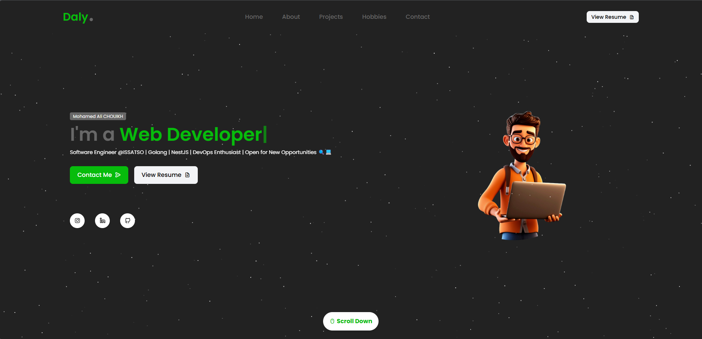

# Portfolio - Mohamed Ali CHOUIKH

A modern, responsive portfolio website built with React, TypeScript, and Tailwind CSS, featuring a stunning starfield background animation, smooth scrolling effects, and a serverless contact form.



## 🌟 Features

- ✅ Modern UI/UX with responsive design
- ✅ Interactive starfield background
- ✅ Smooth scroll animations
- ✅ Contact form with serverless email functionality
- ✅ TypeScript for type safety
- ✅ Tailwind CSS for styling
- ✅ Optimized for performance

## 🚀 Technologies Used

- **Framework**: React 19
- **Language**: TypeScript
- **Build Tool**: Vite
- **CSS Framework**: Tailwind CSS
- **Animations**: ScrollReveal
- **Icons**: React Icons, Unicons
- **Deployment**: Netlify
- **Backend**: Netlify Functions (serverless)
- **Email Service**: Nodemailer

## 🛠️ Getting Started

### Prerequisites

- Node.js (v16 or later recommended)
- npm or yarn

### Installation

1. Clone the repository:
   ```bash
   git clone <your-repo-url>
   cd portfolio
   ```

2. Install dependencies:
   ```bash
   npm install
   # or
   yarn
   ```

3. Create a `.env.local` file in the project root with your email credentials:
   ```
   EMAIL_USER=your-email@gmail.com
   EMAIL_APP_PASSWORD=your-app-password
   ```

4. Start the development server:
   ```bash
   npm run dev
   # or
   yarn dev
   ```

5. Open your browser and navigate to `http://localhost:5173`

## 📁 Project Structure
```
portfolio/
├── netlify/
│   ├── functions/             # Serverless functions
│   │   └── send-email.js      # Email sending function
│   └── templates/
│       └── emailTemplate.js   # Email HTML template
├── public/
│   └── favicon.png            # Favicon
├── src/
│   ├── components/
│   │   ├── sections/          # Main page sections
│   │   └── ui/                # Reusable UI components
│   ├── hooks/                 # Custom React hooks
│   └── main.tsx               # Entry point
├── index.html                 # HTML template
├── tailwind.config.js         # Tailwind configuration
├── vite.config.ts             # Vite configuration
└── package.json               # Dependencies and scripts
```

## 📤 Building and Deployment

### Building for Production

```bash
npm run build
# or
yarn build
```